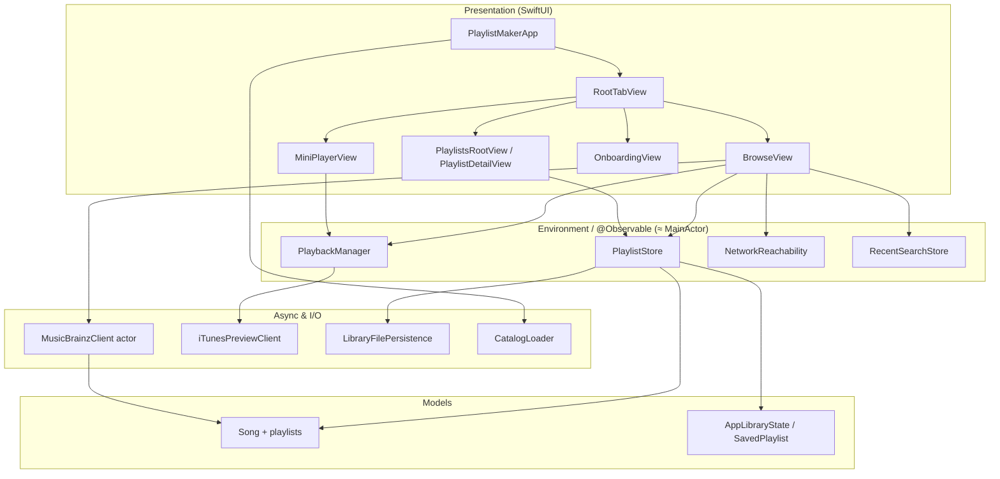

# PlaylistMaker

[](https://swift.org)
[](https://developer.apple.com/xcode/swiftui/)
[](https://developer.apple.com/)
[](https://developer.apple.com/documentation/observation)
[](https://docs.swift.org/swift-book/LanguageGuide/Concurrency.html)
[](https://developer.apple.com/xcode/)

**Highlights:** SwiftUI · Observation (`@Observable` stores) · Music discovery ([MusicBrainz](https://musicbrainz.org/doc/MusicBrainz_API) + iTunes previews) · Local playlists with JSON persistence · Concurrency-aware networking and playback

Native **Apple-platform** app for browsing music, building playlists, and playing **30-second iTunes previews**. The UI is built around a small, testable core: a featured **bundled catalog**, **remote search** with debouncing and pagination, and **file-backed** playlist state—not a thin wrapper around a single API.

## What it does

- **Browse** — Search a local featured catalog (genre filters, optional “hide songs already in playlist”). When online, query **MusicBrainz** with debounced requests, pagination, and polite rate limiting; resolve **iTunes** preview URLs for playback. Offline banner when the network is unavailable.
- **Playlists** — Create, rename, delete, and reorder playlists; add songs from browse; see **statistics** (counts, duration) for the active list; **export** playlist data; undo-friendly flows where applicable.
- **Playback** — **Mini player** with queue / shuffle-style navigation where implemented; playback pauses when the app moves to the background; preview resolution goes through a dedicated HTTP client.
- **Onboarding & polish** — First-launch onboarding; recent search history; themed tab UI (`PlaylistTheme`).
- **Quality** — Unit tests for store behavior, filtering, statistics, and MusicBrainz mapping; UI tests and launch tests for automation hooks (`-uiTesting`, `-resetPlaylist`).

## Architecture

Data and responsibilities are split so **UI stays on the main actor**, **network decoding can run off-thread**, and **models** stay `Sendable` where they cross isolation boundaries (the target uses default **MainActor** isolation for app types; domain types like `Song` opt out with `nonisolated` where needed).



| Layer | Role |
|--------|------|
| **Views** | `NavigationStack`, tabs, sheets (`AddToPlaylistSheet`), environment-injected stores; browse coordinates debounced remote search tasks. |
| **PlaylistStore** | Single `@MainActor` `@Observable` source of truth for catalog + `AppLibraryState`; persists via `LibraryFilePersistence` (JSON in Application Support, migration from legacy storage). |
| **PlaybackManager** | `@MainActor` `AVPlayer` wrapper: preview URL resolution, queue, session tokens to cancel stale work, background pause. |
| **MusicBrainzClient** | `actor` with rate limiting and `Task.detached` JSON decode; maps recordings to stable `Song` identities. |
| **NetworkReachability** | `NWPathMonitor` bridged to observable state for the offline banner. |
| **Persistence** | Versioned `AppLibraryState` encoding; optional test hooks to reset library from launch arguments. |

## Engineering notes

| Area | Approach |
|------|----------|
| **State** | `PlaylistStore` holds catalog + library; `PlaybackManager` owns audio and “now playing”; small focused stores (`RecentSearchStore`, `NetworkReachability`) keep views declarative. |
| **Search UX** | Remote search is **debounced**; results paginate; MusicBrainz client enforces **~1 req/s**-style spacing. |
| **Concurrency** | Network JSON decoding off the cooperative pool where appropriate; `Song` and API DTOs are **nonisolated** / `Sendable` so they align with strict concurrency and background work. |
| **Testing** | Launch arguments for UI tests (`-uiTesting`, `-resetPlaylist`); unit tests for store, filtering, stats, and MB mapping. |

## Tech stack

| Area | Details |
|------|---------|
| **Language** | Swift 5 |
| **UI** | SwiftUI (`TabView`, `NavigationStack`, `List`, environment objects) |
| **State** | Observation (`@Observable`); main-actor stores for UI-facing types |
| **Audio** | `AVPlayer`, iTunes Search API for preview URLs |
| **Networking** | `URLSession`, `MusicBrainzClient` (actor), `NWPathMonitor` |
| **Persistence** | JSON file in Application Support + migration path |
| **Quality** | XCTest (unit + UI + launch) |

## Requirements

- **Xcode** compatible with the project’s deployment target (see `PlaylistMaker.xcodeproj`).
- Run the **PlaylistMaker** scheme on Simulator or device; run **PlaylistMakerTests** / **PlaylistMakerUITests** from the Test navigator.

## Repository layout

```
PlaylistMaker/
├── PlaylistMaker/           # App — views, theme, models, services
├── PlaylistMakerTests/      # Unit tests
└── PlaylistMakerUITests/    # UI & launch tests
```

## Author

**Pann Cherry**
